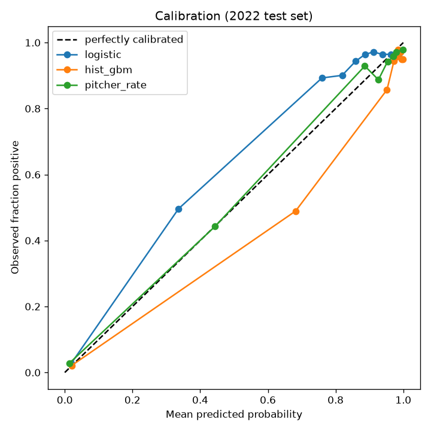

# Methodology & Findings

## Task

Predict whether the first pitch a starting pitcher throws in a game will exceed
**89.95 mph**, using 2021–2022 MLB pitch-tracking data.

## Methodology

I framed the task as binary classification at the level of one row per
(game, starting pitcher) — the pitcher's first pitch of the game, where the
target is whether that pitch exceeds 89.95 mph (~79.5% base rate). Starting
pitchers were isolated by requiring their first pitch to occur in the 1st inning,
and rows with missing velocity were dropped. The central design concern was data
leakage, addressed three ways: the first pitch's own measurements are never used
as inputs; every per-pitcher historical feature (expanding mean/std of prior
first-pitch velocity, prior rate of clearing the threshold, rolling recent
velocity, rest days, and broader prior-game average velocity) is computed using
only that pitcher's earlier games via a date-ordered shift; and the data is split
chronologically, training on 2021 and testing on 2022 to emulate true
forecasting. I benchmarked a logistic regression and gradient-boosted trees
against two baselines (majority class, and each pitcher's prior over-rate).

## Results (2022 test set)

| Model | AUC | Log loss | Brier | Accuracy |
|-------|-----|----------|-------|----------|
| Baseline – majority class | 0.500 | 0.490 | 0.155 | 0.809 |
| Baseline – pitcher historical rate | 0.921 | 0.268 | 0.055 | 0.931 |
| Logistic regression | 0.904 | 0.258 | 0.067 | 0.928 |
| Gradient-boosted trees | 0.904 | 0.255 | 0.063 | 0.928 |

## Findings

The findings are clear and honest: a pitcher's own velocity history
overwhelmingly drives the outcome — with only 60 pitchers in the dataset, a
simple "predict the pitcher's prior over-rate" baseline already achieves 0.92 AUC
and 0.93 accuracy, and the trained models match it on calibration/log loss
(≈0.25) without meaningfully improving ranking. Critically, no model scored a
suspiciously high AUC (~0.99), confirming the pipeline is leakage-free, and all
models are well-calibrated against the diagonal on the 2022 test set. The
practical takeaway is that a compact, leakage-safe per-pitcher feature set is
sufficient for this problem, and additional model complexity yields little gain.
